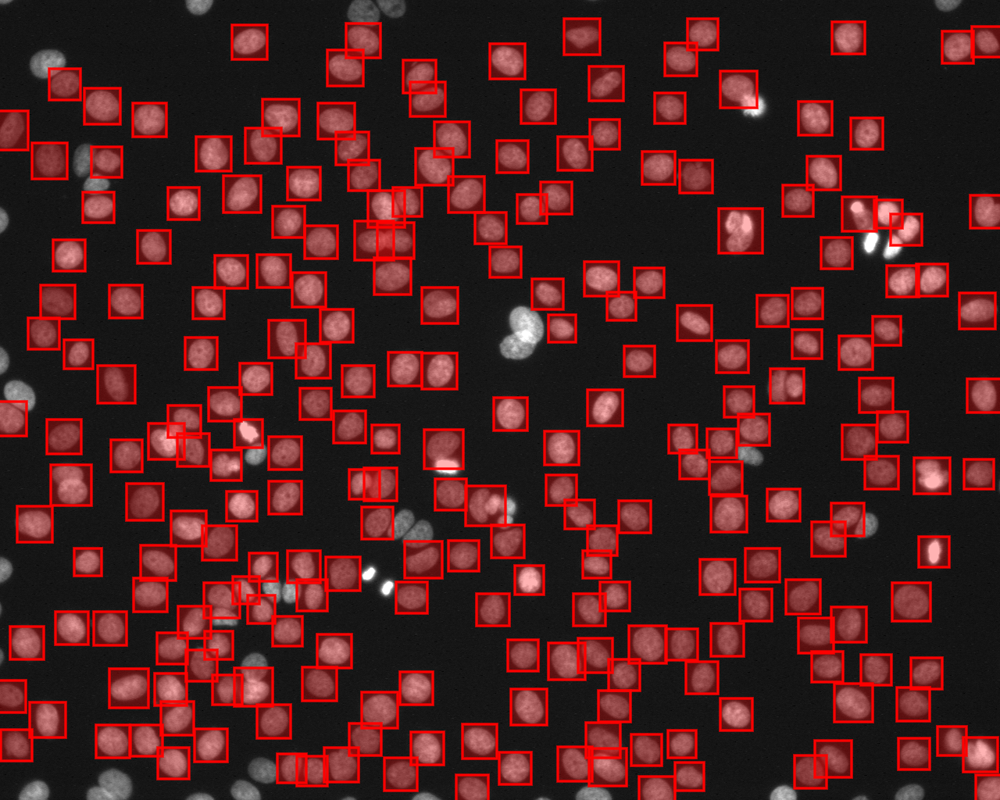
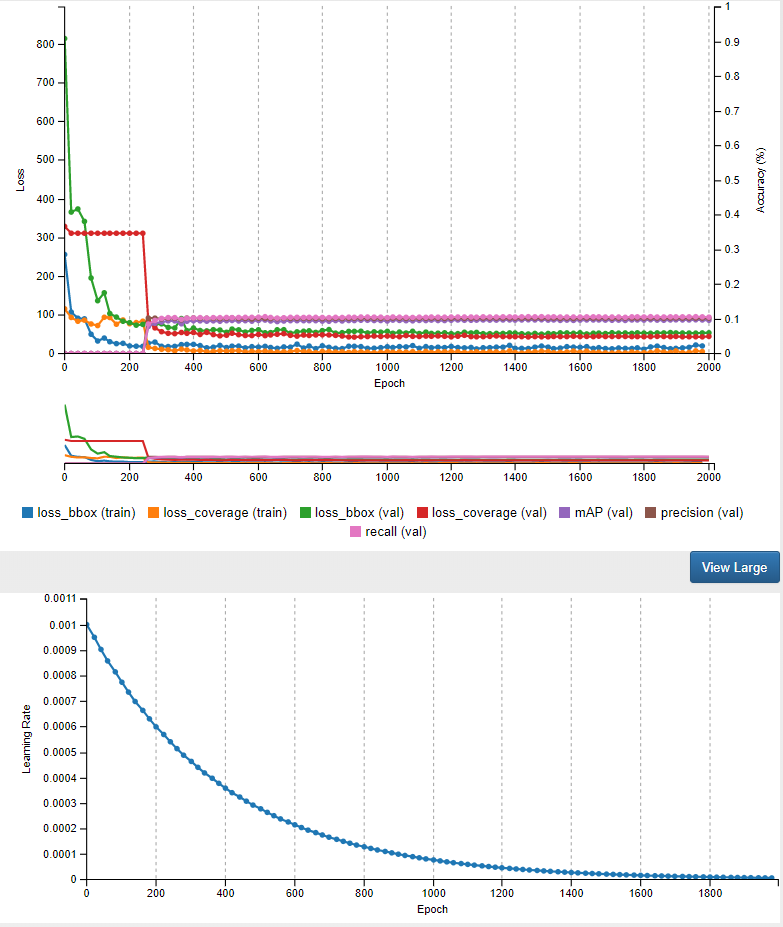

# DL_object_detection

This repo archive an old project on developing the CNN based object detection model for cell nuclei segmentation.

Image (.png) and label(.txt) data are preprocessed by python3.6.
Model training was conducted using the DIGITs interfaced CAFFE deep-learning library on local workstation.

The trained model was able to reach a very high accuracy.

For more detailed description visit the [project presentation slide](https://docs.google.com/presentation/d/1ouIY7mt-2p0N-lwioVJPzqlDqqJ5LgjW/edit?usp=sharing&ouid=108775318649657774029&rtpof=true&sd=true) 
